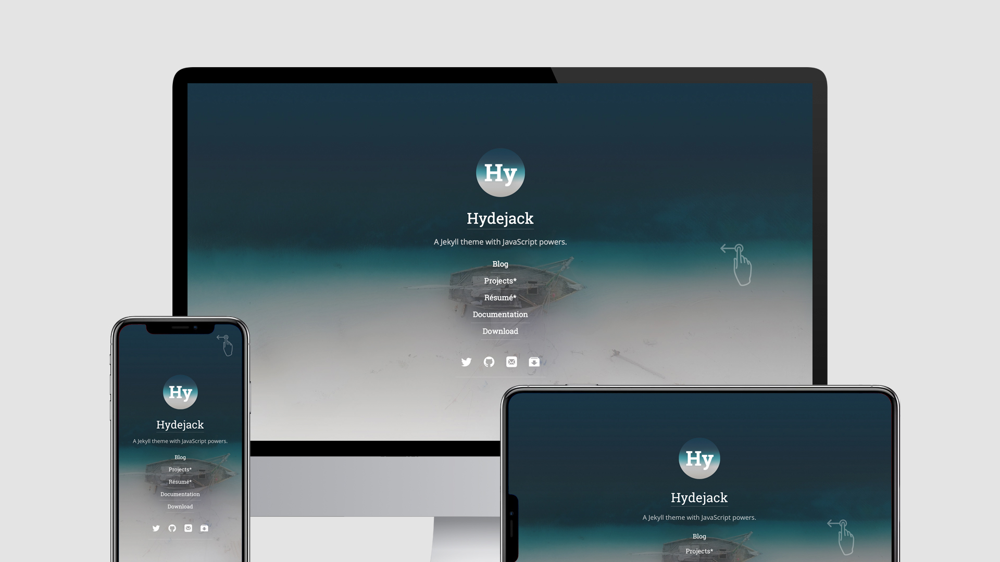
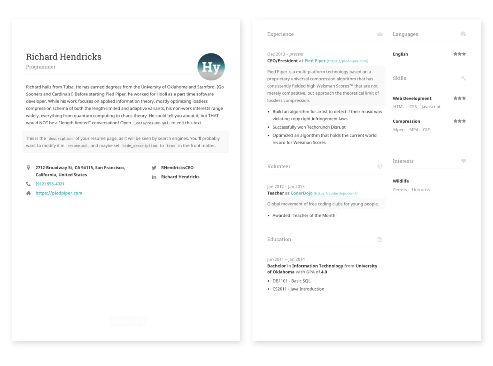
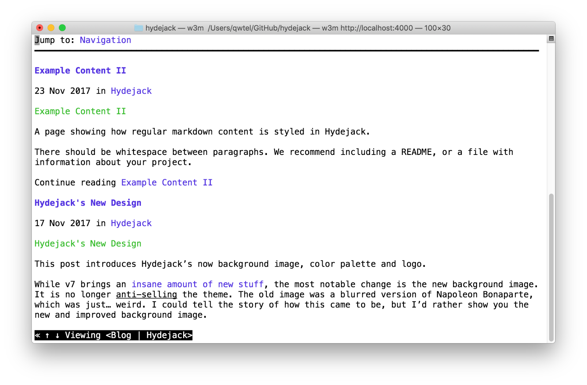

# Hydejack

> "Best Jekyll Theme by a Mile"



Hydejack's cover page on a variety of screens.


**Hydejack** is your presence on the web. It gives you a *blog* that is suitable for both prose and technical documentation, a *portfolio* to showcase your projects, and a beautiful *resume* template that looks amazing on the web and in print.

> Your presence on the web — A [blog], a [portfolio] and a [resume].


There are two versions of **Hydejack**: The base version is free, while features that are specific to *professionals* are a payed upgrade.

[**Download Free**][kit]
– or –
[**Buy PRO**][buy]


## The Basics of Blogging
**Hydejack** started out as a free blogging theme for Jekyll — and continues to be so.

<!--posts-->


## An Impressive Portfolio
A portfolio that's guaranteed to be impressive — no matter what you put into it.

<!--projects-->


## A Printable Resume
Get a resume that's consistent across the board — whether it's on the web, mobile, print, or [PDF](assets/Resume.pdf).


Front and center page of a print resume generated by Hydejack.


## Just Markup
**Hydejack** boasts a plethora of modern JavaScript, but make no mistake: It's still a plain old *web page* at its core. It works without JavaScript, and you can even view it in a text-based browser like `w3m`:


The Hydejack blog, as seen by the text browser `w3m`.


## Syntax Highlighting
**Hydejack** features syntax highlighting, powered by [Rouge].

```js
document.getElementsByTagName("hy-push-state")[0].addEventListener("hy-push-state-load", function() {
  // <your init code>
});
```


## Beautiful Math
They say math is beautiful — and with **Hydejack**'s [math support][latex] it's also guaranteed to *look* beautiful.


Hydejack uses KaTeX to efficiently render math.


<!-- $$
\begin
  \phi(x,y) &= \phi \left(\sum_^n y_je_j \right) \\[2em]
            &= \sum_^n x_i y_j \phi(e_i, e_j)            \\[2em]
            &= (x_1, \ldots, x_n)
               \left(\begin
                 \phi(e_1, e_1)  & \cdots & \phi(e_1, e_n) \\
                 \vdots          & \ddots & \vdots         \\
                 \phi(e_n, e_1)  & \cdots & \phi(e_n, e_n)
               \end\right)
               \left(\begin
                 y_1    \\
                 \vdots \\
                 y_n
               \end\right)
\end
$$ -->


## Build an Audience
The PRO version has built-in support for customizable [Tinyletter] newsletter subscription boxes.

If you are using a different service like MailChimp, you can build a custom newsletter subscription box using [Custom Forms][forms].


## A Personal Site That Belongs to You
**Hydejack** is 100% built on Open Source software, and is Open Source itself, save for parts of the PRO version. The PRO version is a one-time payment that gives you the right to use it forever.


## Features
An incomplete list of features included in all versions of **Hydejack**:

* Full in-app page loading, powered by [hy-push-state]
* Customizable sidebar and touch-enabled drawer menu, powered by [hy-drawer]
* Lazy image loading with cancellation and placeholder, powered by [hy-img]
* Advanced FLIP animations, inspired by Material Design
* 99/100 [Google PageSpeed Score][gpss][^2]
* [Syntax highlighting](#syntax-highlighting), powered by [Rouge]
* [LaTeX math blocks][latex], powered by [KaTeX]
* Change the wording of built-in strings and possibly translate in other languages
* Support for categories and tags
* Built-in icons for many social networks
* Simple and semantic HTML
* Structured Data for core entities
* Author section below each article and support for multiple authors
* Google Analytics and Google Fonts support
* Disqus comments
* Optional cookies banner


## Download
There are two versions of **Hydejack**: The *free version* includes basic blogging functionality, as did previous versions of the theme.
The *PRO version* includes additional features for professionals:
A [portfolio], a [resume] layout, and a [welcome] page to highlight your favorite projects and posts.

This table below shows what's included in each version:

|                        | Free           | PRO      |
|:-----------------------|:--------------:|:--------:|
| Blog                   | &#x2714;       | &#x2714; |
| [Features]             | &#x2714;       | &#x2714; |
| [Portfolio]            |                | &#x2714; |
| [Resume]               |                | &#x2714; |
| [Welcome]              |                | &#x2714; |
| [Newsletter Box][news] |                | &#x2714; |
| [Custom Forms][forms]  |                | &#x2714; |
| No Hydejack Branding   |                | &#x2714; |
| License                | [GPL-3.0][lic] | [PRO]    |
| Source                 | [GitHub][src]  | Included |
| Support[^1]            | No             | No       |
| Price                  | Free           | $59      |
| | [**Download**][kit] | [**Buy PRO**][buy] |


[^1]: You MAY open an issue on GitHub, but no response and/or fix is guaranteed.
      You understand that using Jekyll requires technical know-how and is not comparable to Wordpress in terms of ease of use. Please use the free version to confirm that Hydejack works for you. For details, see the [PRO] license.

[^2]: Actual page load speed depends on your hosting provider, resolution of embedded images and usage of 3rd party plugins.

[blog]: https://hydejack.com/blog/
[portfolio]: https://hydejack.com/projects/
[resume]: https://hydejack.com/resume/
[download]: https://hydejack.com/download/
[welcome]: https://hydejack.com/
[forms]: https://hydejack.com/forms-by-example/

[features]: #features
[news]: #build-an-audience
[syntax]: #syntax-highlighting
[latex]: hydejack/_posts/2018-06-01-example-content-iii.md#math

[lic]: LICENSE.md
[pro]: licenses/PRO.md
[docs]: docs/8.0.0/README.md

[kit]: https://github.com/qwtel/hydejack-starter-kit/archive/v8.0.0.zip
[src]: https://github.com/qwtel/hydejack
[gem]: https://rubygems.org/gems/jekyll-theme-hydejack
[buy]: https://app.simplegoods.co/i/NATYVLYT

[gpss]: https://developers.google.com/speed/pagespeed/insights/?url=https%3A%2F%2Fhydejack.com%2F
[hy-push-state]: https://qwtel.com/hy-push-state/
[hy-drawer]: https://qwtel.com/hy-drawer/
[hy-img]: https://qwtel.com/hy-img/
[rouge]: http://rouge.jneen.net
[katex]: https://khan.github.io/KaTeX/
[tinyletter]: https://tinyletter.com/

*[FLIP]: First-Last-Invert-Play. A coding technique to achieve performant page transition animations.
