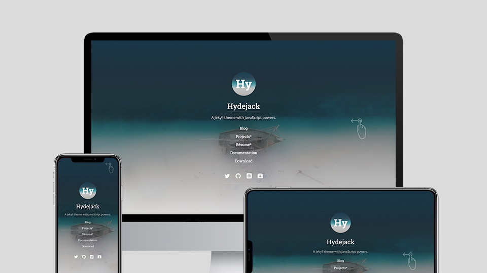

# Basics
This chapter covers the basics of content creation with Hydejack.

## Table of Contents
{:.no_toc}

0. this unordered seed list will be replaced by toc as unordered list
{:toc}


## Adding a page
You can add generic pages that support markdown content but aren't blog posts.
For example, this documentation is written in markdown, consisting of several generic pages.

To add a page, create a new markdown file and put `layout: page` in a front matter

~~~yml
---
layout: page
title:  Documentation
---
~~~

Now you can add content as you would in a blog post.


## Adding an entry to the sidebar
To add links to the sidebar, populate the `menu` entry in `_config.yml` with a list of `title`-`url` pairs, e.g.:

```yml
# file: _config.yml
menu:
  - title: Blog
    url:   /blog/
  - title: Projects
    url:   /projects/
  - title: Resume
    url:   /resume/
  - title: About
    url:   /about/
```

### Adding a link to an external page to the sidebar
To add links to external sites, simply provide a fully qualified URL, e.g.

```yml
menu:
  - title: "@qwtel"
    url:   https://qwtel.com/
```

## Adding a category or tag
Hydejack allows you to use the `list` layout to show all posts of a particular category or tag.

Before you start, make sure your config files contains the `features_categories` and `featured_tags` collections:

~~~yml
# file: _config.yml
collections:
  featured_categories:
    permalink:         /:name/
    output:            true
  featured_tags:
    permalink:         /tag-:name/
    output:            true
~~~

### Recap: Categories and tags in Jekyll
Posts in Jekyll can belong to one or more categories, as well as one or more tags. They are defined in a post's front matter:

~~~yml
---
layout:     post
title:      Welcome to Jekyll
categories: [jekyll, update]
tags:       [jekyll, update]
---
~~~

Posts can also be assigned to a category based on their position within the folder structure, e.g.

~~~
├── jekyll
│   └── update
│       └── _posts
│           └── 2017-04-07-welcome-to-jekyll.markdown
~~~

This will place "Welcome to Jekyll" in the categories `jekyll` and `update`.

**NOTE**: This is now the preferred way of assigning categories in Hydejack, as it makes URLs correspond more naturally to the underlying folder structure.
{:.message}

Whether you use this method or not, categories will always be part of a posts URL, while tags will not.

Type       | URL
-----------|----
Categories | `/jekyll/update/2017-04-07-welcome-to-jekyll/`
Tags       | `/2017-04-07-welcome-to-jekyll/`
{:.scroll-table-small}

As far as Jekyll is concerned, this is the only difference.

### Categories and tags in Hydejack
Categories and tags are displayed by Hydejack below the title, after the date. Categories are displayed with the preposition "in", while tags are displayed with the preposition "on", e.g.

Type       | Title
-----------|------
Categories | Welcome to Jekyll¬ 07 Apr 2017 **in** Jekyll / Update
Tags       | Welcome to Jekyll¬ 07 Apr 2017 **on** Jekyll, Update
Both       | Welcome to Jekyll¬ 07 Apr 2017 **in** Jekyll / Update **on** Jekyll, Update
{:.scroll-table-small}

You can adjust these in [`_data/string.yml`](https://github.com/qwtel/hydejack/blob/v8/_data/strings.yml).

### Creating a new category or tag
By default, categories and tags are rendered as plain text. Further steps are necessary if you want them to link to a page that contains a list of all posts that belong to that category or tag.

For each featured category or tag, a file called `<category-name>.md` or `<tag-name>.md` has to be created inside the `_featured_tags` and `_featured_categories` folders, respectively. Each file in these folders is part of a [Jekyll Collection](https://jekyllrb.com/docs/collections/).

The meta data of a category or tag is set in the files front matter, e.g.

~~~yml
---
# file: _featured_categories/hyde.md
layout: list
title:  Hyde
slug:   hyde
description: >
  Hyde is a brazen two-column [Jekyll](http://jekyllrb.com) theme.
  It's based on [Poole](http://getpoole.com), the Jekyll butler.
---
~~~

`layout`
: Must be `list`

`title`
: Used as title of the page, as well as name of the category or tag as part of the line below a blog post's title. Can be different from the name of the tag or category, as long as `slug` is identical to the name.

`slug`
: Must be identical to the key used in the blog's front matter, i.e. if you use `categories: [jekyll]` the `slug` must be `jekyll`. By default, the slug is derived from the title, but here it is recommended that you set it explicitly.

`description`
: A medium-length description, used on the tag or category's detail page and shown in a message box below the title.

`menu`
: Set to to `true` if you want the category or tag to appear in the sidebar. For more information, see [Adding an entry to the sidebar](#adding-an-entry-to-the-sidebar).

Once the file is created, the page can be found at `/category/<categoryname>/` or `/tag/<tagname>/`.


## Adding an about page
About pages are a frequent use case, so Hydejack has a special layout for it. It is a slight modification of the `page` layout that allows showing the author information by adding the `<!--author-->` marker somewhere on the page.

To create an about page, make sure `layout` is set to `about`.
For more on authors, see [Adding an author](config.md#adding-an-author).

~~~yml
---
# file: about.md
layout: about
title:  About
---
~~~


## Adding a cover page
Hydejack 8 introduces cover pages, i.e. pages witht he sidebar opened, so that it spans the entire screen. This feature is intended for landing pages. To enable it on a page, simply add `cover: true` to the front matter.

{:data-width="960" data-height="540"}


## Customization
### Adding custom CSS
The quickest and safest way to add custom CSS to Hydejack is via the `_sass/my-inline.scss` and `_sass/my-style.scss` files (create the folder/the files if they don't exist).

To add CSS that gets inlined into the page, i.e. is loaded with the first request, put the CSS rules into `my-inline.scss`. This is intended for above-the-fold content. Otherwise put the CSS rules into `my-style.scss`.
Note that this distinction has no effect when `no_inline_css` is enabled.


### Adding custom HTML to the head
To add custom HTML elements to the `<head>` of the document, open `_includes/my-head.html` (create the folder/the files if they don't exist) and add your elements there.


### Adding custom HTML to the body
To add custom HTML elements to the `<body>` of the document, open `_includes/my-body.html` (create the folder/the files if they don't exist) and add your elements there.

What's the difference to `my-scripts.html`?
: This file was used in earlier versions of Hydejack to accomplish the same goal. However, there are still instances were you might want to prefer `my-scripts.html` over `my-body.html`, as it won't load scrips on redirect pages and will be ignored by browsers < IE10.


## Adding a welcome page*
If you bought the PRO version of Hydejack you have access to the `welcome` layout.
It is intended to showcase your projects and blog posts in a compact way.
Technically, it is a modified version of the `about` layout, so it allows showing the author information where the `<!--author-->` marker is put. [Demo][welcome].

You can create a welcome page by creating a new markdown file and setting the layout to `welcome` in the front matter.

~~~yml
---
# file: index.md
layout: welcome
title:  Welcome
cover:  true
---
~~~

Without further configuration, the welcome page will just look like a regular page.
To show the two most recent projects, add the `<!--projects-->` marker to the content.
To show the five most recent blog posts, add the `<!--posts-->` marker to the content.

The welcome layout also supports selecting specific projects and posts, by adding to the front matter, e.g.:

~~~yml
---
# file: index.md
selected_projects:
  - _projects/hydejack-v6.md
  - _projects/hyde-v2.md
more_projects: projects.md
selected_posts:
  - _posts/2017-05-03-javascripten.md
  - _posts/2012-02-07-example-content.md
more_posts: posts.md
featured: true
---
~~~

`selected_projects`
: A list of paths to project files that should be displayed below the main content of the page.
  The paths are relative to the main directory with no leading `./`.
  If no paths are provided, the two most recent projects will be used.

`more_projects`
: The path to the main projects page.
  The path is relative to the main directory with no leading `./`.

`selected_projects`
: A list of paths to blog posts that should be featured on the welcome page.
  The paths are relative to the main directory with no leading `./`.
  If no paths are provided, the five most recent posts will be used.

`more_posts`
: The path to the main posts page.
  The path is relative to the main directory with no leading `./`.

`featured`
: Optional. When `true`, project thumbnails will span the full width instead of half.
  This setting takes precedence over the `featured` value of individual projects,
  i.e. it will apply to the entire page.


## Adding a projects page*
The projects page will show all projects in a particular collection.
First, you need to make sure that you have the `projects` collection defined in `_config.yml`:

~~~yml
# file: _config.yml
collections:
  projects:
    permalink: /projects/:path/
    output:    true
~~~

Next, add a `projects.md` to in the root (you can adjust the name/location to match the `permalink` of the
collection).
This file has the `projects` layout (mind the "s" at the end) and should have a `show_collection` key,
with the name of the collection as a value, e.g.:

~~~yml
---
# file: projects.md
layout:          projects
title:           Projects*
show_collection: projects
featured:        true
---
~~~

`layout`
: Must be `projects`.

`title`
: The title of the page. Note that this name is reused as part of each individual project page
  (for the link that directs back to the projects page).

`show_collection`
: The name of the collection you want display on this page. Defaults to `projects`.

`featured`
: Optional. When `true`, project thumbnails will span the full width, instead of only half.
  This setting takes precedence over the `featured` value of individual projects,
  i.e. it will apply to the entire page.


## Adding a project*
Projects are organized using [Jekyll Collections](https://jekyllrb.com/docs/collections/).
Each project generates an entry on the projects layout ([Demo][projects]) as well as its own detail page ([Demo][project]).

Each project is defined by a file in the `_projects` directory.
The project's meta information is defined in the file's front matter. You can also add markdown content.
A project's front matter should look like:

~~~yml
---
# file: _projects/hyde-v2.md
layout:      project
title:       Hyde v2*
date:        2 Jan 2014
screenshot:
  src:       /assets/img/projects/hyde-v2@0,25x.jpg
  srcset:
    1920w:   /assets/img/projects/hyde-v2.jpg
    960w:    /assets/img/projects/hyde-v2@0,5x.jpg
    480w:    /assets/img/projects/hyde-v2@0,25x.jpg
caption:     Hyde is a brazen two-column Jekyll theme.
description: >
  Hyde is a brazen two-column [Jekyll](http://jekyllrb.com) theme.
  It's based on [Poole](http://getpoole.com), the Jekyll butler.
links:
  - title:   Demo
    url:     http://hyde.getpoole.com
  - title:   Source
    url:     https://github.com/poole/hyde
featured:    false
---
~~~

`layout`
: Must be set to `project`

`date`
: Providing a year is the minimum requirement. Used to sort the projects.

`screenshot`
: A 16:9 screenshot of the project.

  You can pass an URL to an image, but it is recommended that you provide a `src`-`srcset` pair (see example above).

  Hydejack will show the screenshot in various sizes, depending on the screen width, so that no specific size will fit all. Instead, it is recommended that you use a [mipmap]-like approach, providing the image in multiple sizes, each image half the width of the previous one.
  The `src` key is a fallback image for browsers that don't support the `srcset` attribute. The keys of the `srcset` hash will be used as descriptors.

  For more information on `srcset`, see the [documentation at MDN](https://developer.mozilla.org/en-US/docs/Web/HTML/Element/img#attr-srcset), or [this article from CSS-Tricks](https://css-tricks.com/responsive-images-youre-just-changing-resolutions-use-srcset/).

`caption`
: A short description, shown as part of each "project card" in the `projects` layout.

`description`
: A medium-length description, used on the project's detail page as meta description and shown as message box below the screenshot.

`links`
: A list of `title`-`url` pairs that link to external resources related to this project.

`author`
: Optional. The author shown below the project, similar to posts.

`featured`
: Optional. When `true`, the project preview will span the full content width. You can use this for projects that should receive more attention. You can set/override this for an entire page, by setting `featured` in the front matter (applies to the `projects` and `welcome` layout).


## Adding a resume*
Hydejack's PRO version features a generalized resume layout.
[Demo][resume].

It generates the resume page from a valid [JSON Resume](https://jsonresume.org/), which is good news if you already have a JSON resume. Otherwise, there are various ways of obtaining one:

* You can edit the [example `resume.yml`](https://github.com/qwtel/hydejack/blob/v8/_data/resume.yml) in `_data` directly. It contains example entries for each type of entry.
* You can use the visual [JSON Resume Editor](http://registry.jsonresume.org/).
* If you have a LinkedIn profile, you can try [LinkedIn to Json Résumé](https://jmperezperez.com/linkedin-to-json-resume/).

Once you have a JSON Resume, place it into `_data`.

To render a resume page, create a new markdown file and set the layout to `resume` in the front matter:

~~~yml
---
# file: resume.md
layout: resume
title:  Resume
description: >
  A short description of the page for search engines (~150 characters long).
---
~~~

**NOTE**: You can download the final `resume.json` (minified) from the assets folder. When running locally, you can find it at `_site/assets/resume.json`.
{:.message}

### Adding a specialized resume or multiple resumes
You can add a specialized resume or multiple resumes by adding the resume YAML to the front matter under the `resume` key.
E.g.:

~~~yml
---
# file: resume.md
layout: resume
title:  Resume
description: >
  A short description of the page for search engines (~150 characters long).
resume:
  basics:
    name: "Richard Hendricks"
    label: "Programmer"
    picture: "/assets/icons/icon.png"
  # ...
---
~~~


Continue with [Writing](writing.md){:.heading.flip-title}
{:.read-more}

[welcome]: https://hydejack.com/
[resume]: https://hydejack.com/resume/
[projects]: https://hydejack.com/projects/
[project]: https://hydejack.com/projects/default/

[mipmap]: https://en.wikipedia.org/wiki/Mipmap
